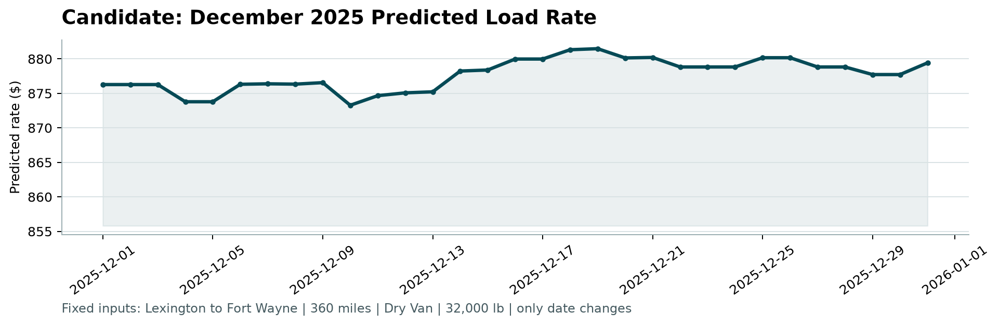

# Spotter Freight Rate Prediction

Machine Learning Engineer Assessment submission — predicts freight spot rates
using a tuned LightGBM + XGBoost ensemble, validated on a chronological holdout.

## Setup

```bash
python -m venv venv
source venv/bin/activate        # Windows: venv\Scripts\activate
pip install -r requirements.txt
```

Place the assessment data files in `data/raw/`:
- `train-test.csv`
- `validation.csv`
- `validation-predictions-template.csv`
- `december_chart_inputs.csv`

## Run

```bash
python run.py
```

Runs the full pipeline end-to-end: load data → preprocess/clean → engineer
features → chronological train/validation split → tune & train the
LightGBM+XGBoost ensemble (Optuna) → evaluate on the holdout → generate
predictions for `validation.csv` → generate the December scenario predictions
→ validate everything and produce the chart via the provided `score.py`.

**Flags:**
- `--skip-tune` — use default hyperparameters instead of running Optuna
- `--n-trials N` — number of Optuna trials (default 50)
- `--predict-only` — skip training, use the already-saved model

## Results

Evaluated on a chronological holdout (most recent month, ~9,500 loads):

| Metric | Value |
|---|---|
| RMSE | $581.41 |
| MAE | $127.22 |
| MAPE | 5.28% |
| R² | 0.8548 |
| Within 10% of actual | 94.30% |
| Within 20% of actual | 96.68% |

10-fold cross-validation on the transformed target: RMSE 0.1552 (±0.0118),
confirming the holdout result is stable across splits.

**Best hyperparameters (Optuna, 50 trials):** `num_leaves=62, max_depth=12,
learning_rate=0.035, n_estimators=803, min_child_samples=19, subsample=0.915,
colsample_bytree=0.777, reg_alpha=0.313, reg_lambda=3.385`. Ensemble blend:
LightGBM 60% / XGBoost 40%.

### December scenario

Fixed inputs (Lexington → Fort Wayne, 360 mi, Dry Van, 32,000 lb), only the
date changes across all 31 days:



## Outputs

| File | Description |
|---|---|
| `outputs/predictions/validation_predictions.csv` | Final `load_id,predicted_rate` submission file |
| `outputs/predictions/december_predictions.csv` | December scenario predictions |
| `outputs/figures/residual_plot.png` | Residual diagnostics |
| `outputs/figures/feature_importance.png` | Top-20 feature importances |
| `outputs/reports/model_report.txt` | Full metrics report |
| `scorer_results/candidate_december.png` | Official December chart from `score.py` |

## Project structure

spotter/
├── data/raw/ — input CSVs (not committed; see Setup)
├── src/ — pipeline source (preprocessing, features, train, evaluate, predict)
├── run.py — end-to-end pipeline entry point
├── score.py — provided validator / chart renderer (unmodified)
├── outputs/ — predictions, figures, reports (generated)
├── models/ — saved model + feature metadata (generated)
└── requirements.txt

## Approach summary

Full write-up in `Spotter_ML_Assessment_Report.pdf`. Short version:
- **Split:** chronological — train on earlier dates, hold out the most recent
  month — avoids leaking future dates into training the way a random split would.
- **Model:** LightGBM + XGBoost ensemble, Optuna-tuned.
- **Known limitation:** underpredicts the rare (<0.5% of data) high-value
  load segment; documented in the report with a proposed fix (quantile
  regression / oversampling).

## Original assessment brief

See `ASSESSMENT.md` (renamed from the original `README.md`) and
`Freight_Rate_ML_Assessment.pdf` for the original task instructions.